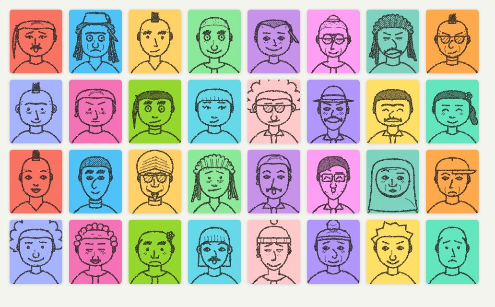
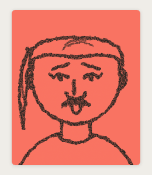

# pencil-faces

Little pencil-drawn portraits as SVG, generated from a number.



I drew these for a geography game where every player gets a passport photo.
A seed rolls a face: head shape, hair, eyes, brows, nose, mouth, clothes,
maybe a beard, glasses, a hat or headphones. An SVG filter roughens the lines
so they look like graphite on paper. The same seed gives the same face on
every machine, so a game only has to send a 32-bit number around.

There is no randomness hidden inside the renderer. A seed produces a plain
`FaceConfig` object, and the renderer turns a config into an SVG string. You
can edit the config, store it, or build one from scratch in a face editor.
No dependencies, works in the browser and in Node.

## Install

```sh
npm install pencil-faces
```

ESM only, with type declarations.

## Usage

```ts
import { faceFromSeed, renderFace, pencilDefs } from 'pencil-faces';

// Once per page: the pencil filter every face refers to.
document.body.insertAdjacentHTML('beforeend', pencilDefs());

const face = faceFromSeed(1234567);
avatar.innerHTML = renderFace(face);
```

The SVG has no fixed size and fills its container. Lines use the CSS `color`
of the container; shapes that cover something (the head in front of long
hair, a hat over the forehead) are filled with `--c`, so set that to the
colour of the box:

```css
.avatar {
  --c: #f3d9a4;     /* paper */
  color: #2b2622;   /* pencil */
  width: 96px;
  aspect-ratio: 38 / 46;
  background: var(--c);
}
```



To change a face, change its config. `faceFromSeed` takes overrides that
replace fields after the roll, so everything else stays the same:

```ts
faceFromSeed(42, { hair: 'afro', glasses: 'round', marks: { freckles: true } });
```

`defaultFace()` returns a plain friendly face to start an editor from, and
`FACE_OPTIONS` lists the allowed values per field for building pickers.

The config has one numeric field, `jitter`. It seeds the proportions (head
width, eye spacing, nose length) and the small wobble that keeps a hand
drawing from being perfectly symmetric. Swapping the hairstyle never moves
the eyes.

## Options

| Field | Values |
| --- | --- |
| `shape` | `oval` `square` `long` `round` `pear` `heart` |
| `clothes` | `crewneck` `vneck` `shirtTie` `turtleneck` `hoodie` `stripes` |
| `ears` | `small` `big` |
| `eyes` | `dot` `open` `lidded` `happy` `wide` `squint` `tired` `lash` |
| `wink` | `true` closes the right eye |
| `brows` | `straight` `arch` `angry` `worried` `bushy` `unibrow` `thin` `raised` |
| `nose` | `plain` `hook` `bulb` `snub` `wide` `pointed`, plus `noseSide` |
| `mouth` | `line` `smile` `grin` `surprised` `crooked` `pout` `frown` `dimples` |
| `marks` | `laughLines` `foreheadLines` `crowsFeet` `chinDimple` `freckles` |
| `beard` | `none` `moustache` `handlebar` `full` `goatee` `stubble` |
| `hair` | `bald` `short` `sidePart` `curly` `afro` `bun` `long` `bangs` `mohawk` `spiky` `braid` `slickedBack` |
| `hat` | `none` `beanie` `cap` `brimmed` `headband` |
| `glasses` | `none` `round` `square` `sunglasses` `monocle` |
| `extra` | `none` `headphones` `earring` `flower` `pencil` |

`renderFace(config, options)` takes `filterId` (default `pencil-face`,
`null` for clean vector lines), `className`, `background` and `stroke` if
you would rather not use CSS variables.

## Styling

Paths carry four classes you can tune from a stylesheet: `fill` for solid
dots such as pupils and freckles, `detail` for small extras, `soft` for
shading and strands of hair, `thick` for bold strokes. They come with
sensible defaults, so a face looks right without any CSS. Stroke widths are
in viewBox units and scale with the picture; tiny faces read better with
thicker lines and `.detail { display: none }`.

## Demo

`npm install && npm run demo` opens a page with a seed field, a picker for
every option and a gallery of random faces.

## License

[MIT](LICENSE)
